<!-- Animated typing header -->

<!-- Typing SVG -->

 

 

## 🚀 About Me

- 🌱 &nbsp;Aspiring **Full Stack Developer**, currently deep-diving into the **MERN Stack**
- 💻 &nbsp;Passionate about building clean, functional, and user-friendly web apps
- 📍 &nbsp;Based in **Odisha, India**
- 🎯 &nbsp;Actively looking for **internships & entry-level opportunities**
- ⚡ &nbsp;Fun fact: I debug better with a cup of chai ☕
- 📫 &nbsp;Reach me at: *add your email here*

 

## 🖥️ Terminal Overview

## 🛠️ Tech Stack

### Languages

### Frontend

### Backend

### Database

### Tools & Platforms

## 📊 GitHub Stats

 

 

## 🏆 GitHub Trophies

## 🐍 Contribution Snake

## 🤝 Connect With Me

  <i>⭐️ Thanks for stopping by — feel free to explore my repositories!</i>

